# Allwinner H3 Based Mini PC for Embedded Linux Applications

This repository contains the complete schematic-level design of an Allwinner H3 based Mini PC capable of running Embedded Linux. The project focuses on the architectural understanding of processor-based embedded systems including DDR3 memory interfacing, Linux booting, bootloader storage, power management, USB, HDMI, and Wi-Fi/Bluetooth integration.

The design is implemented using KiCad and demonstrates how an Embedded Linux hardware platform is architected around an application processor.

---

# Project Overview

The proposed system is built around the Allwinner H3 application processor and supports Linux booting using external DDR3 memory and non-volatile boot storage such as SPI Flash and Micro SD card.

The project includes:

- Hierarchical schematic design
- DDR3 memory subsystem
- SPI Flash boot storage
- Micro SD card boot support
- USB-C OTG interface
- USB Host interface
- HDMI display output
- RTL8723DS Wi-Fi/Bluetooth module
- Multi-rail power management
- Linux boot architecture explanation

---

# System Architecture

The complete system architecture is shown below.

<p align="center">
  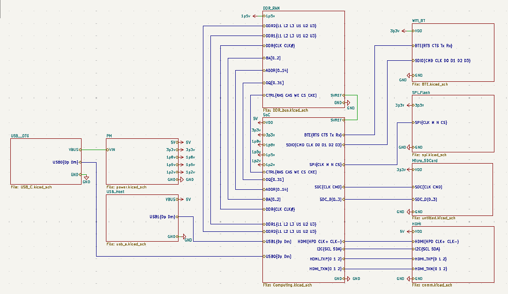
</p>

The top-level schematic consists of the following major blocks:

- Allwinner H3 Processing Subsystem
- DDR3 Memory Subsystem
- SPI Flash Boot Storage
- Micro SD Card Interface
- USB Interfaces
- HDMI Display Interface
- Wi-Fi/Bluetooth Module
- Power Management Circuit

---

# Allwinner H3 Processing Architecture

The Allwinner H3 acts as the central processing unit of the system and is responsible for Linux booting, DDR initialization, peripheral communication, and overall system control.

<p align="center">
  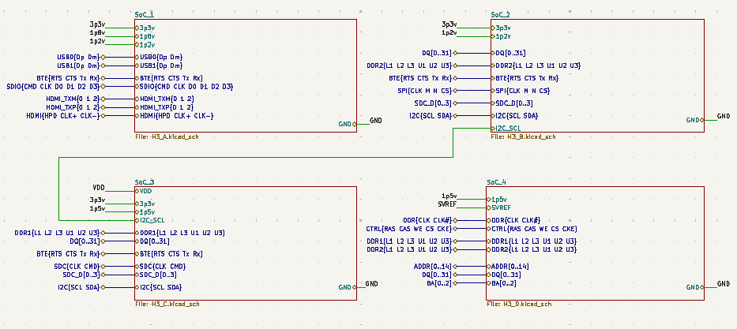
</p>

The processor supports:

- DDR3 memory controller
- USB 2.0
- HDMI
- SPI
- SDIO
- UART
- I2C
- GPIO interfaces

---

# DDR3 Memory Architecture

The design uses two AS4C256M16D3L DDR3 devices.

Each DDR3 chip provides:

- 512 MB capacity
- 16-bit data width

Total memory:

```text
512 MB × 2 = 1 GB DDR3 RAM
```

The address and control buses are shared between both DDR3 devices, while the data bus is split into two 16-bit sections.

- DDR1 handles DQ[0..15]
- DDR2 handles DQ[16..31]

Together, they form a complete 32-bit DDR3 memory interface.

## DDR3 Top-Level Connection

<p align="center">
  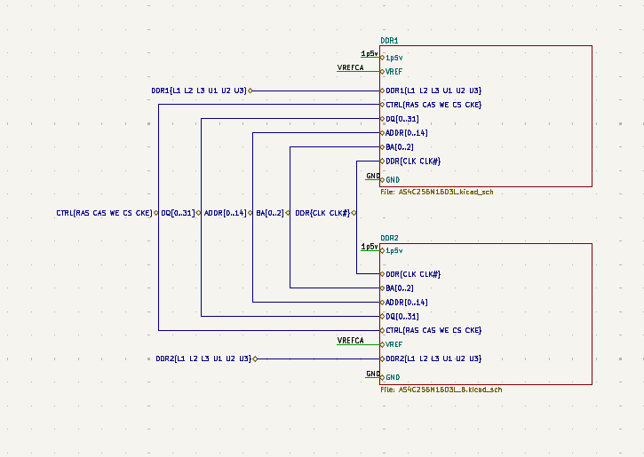
</p>

## DDR3 Device 1

<p align="center">
  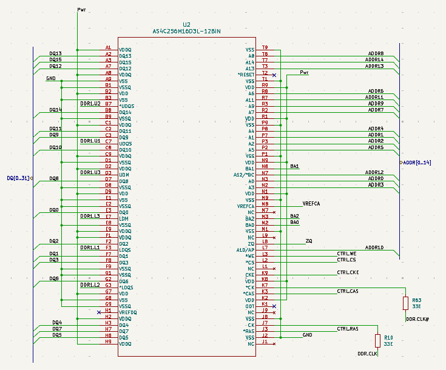
</p>

## DDR3 Device 2

<p align="center">
  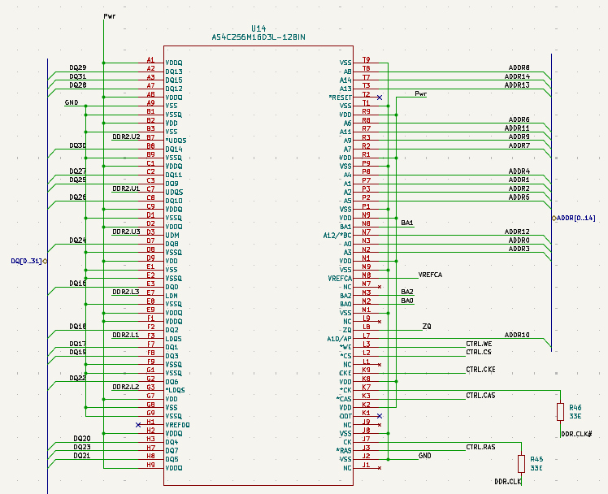
</p>

---

# Boot Storage

The system supports two boot storage methods:

- SPI Flash
- Micro SD Card

## SPI Flash

The SPI Flash stores the SPL and U-Boot bootloader.

<p align="center">
  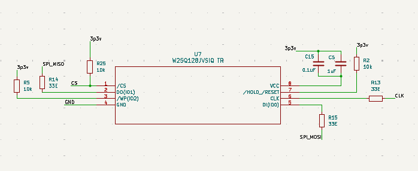
</p>

## Micro SD Card

The Micro SD card stores:

- SPL
- U-Boot
- Linux Kernel
- Device Tree
- Root File System

<p align="center">
  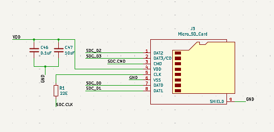
</p>

---

# Linux Booting Process

The Linux boot sequence is:

```text
1. Power rails stabilize
2. Reset is released
3. Internal Boot ROM starts execution
4. Boot device detection occurs
5. SPL is loaded into SRAM
6. DDR3 memory initialization is completed
7. U-Boot is loaded into DDR3 RAM
8. Linux kernel and device tree are loaded
9. Linux starts execution from DDR3
```

The operating system is permanently stored in SPI Flash or SD card, while DDR3 memory acts as the runtime execution memory.

---

# USB Interfaces

The project contains both USB-C OTG and USB Host interfaces.

## USB-C OTG

<p align="center">
  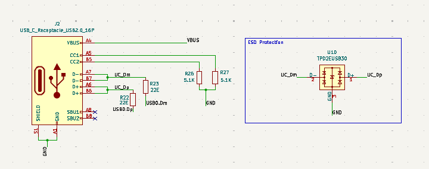
</p>

## USB Host

<p align="center">
  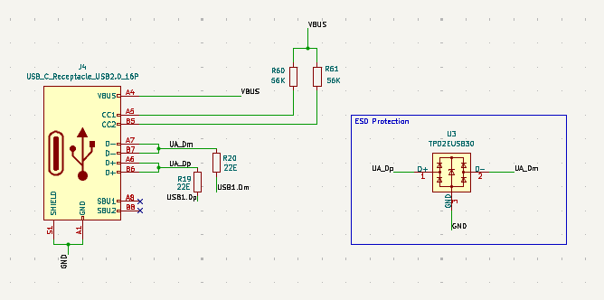
</p>

The USB differential signals require controlled impedance routing in practical PCB implementation.

---

# HDMI Interface

The HDMI interface provides display output to an external monitor.

<p align="center">
  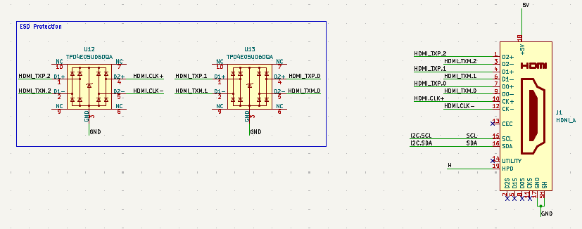
</p>

The HDMI interface uses TMDS differential signaling for high-speed digital video transmission.

---

# Wi-Fi and Bluetooth

The project uses the RTL8723DS-CG Wi-Fi/Bluetooth module.

<p align="center">
  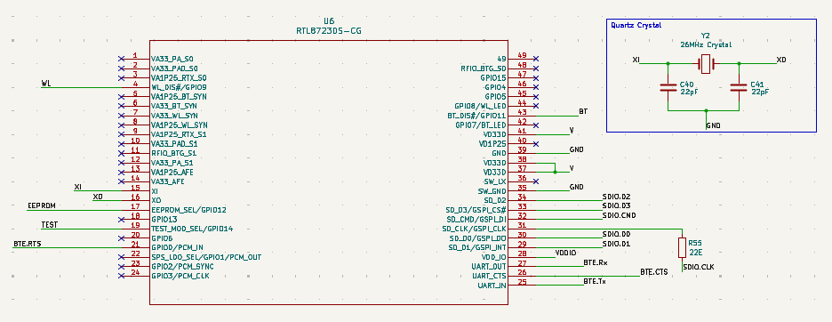
</p>

The module uses:

- SDIO for Wi-Fi communication
- UART for Bluetooth communication

---

# Power Management

Multiple voltage rails are required because different system blocks operate at different voltage levels.

## Voltage Rails Used

| Voltage Rail | Purpose |
|---|---|
| 5 V | Main input and HDMI supply |
| 3.3 V | I/O interfaces and peripherals |
| 1.8 V | PLL and interface supplies |
| 1.5 V | DDR3 memory supply |
| 1.2 V | Processor core supply |

## Power Management Schematic

<p align="center">
  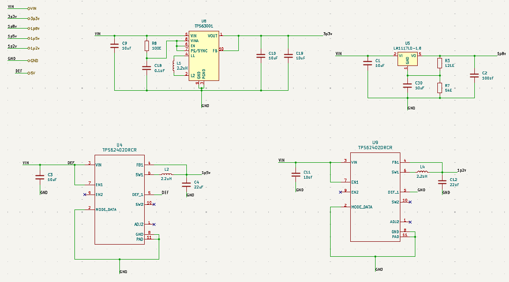
</p>

---

# Dumping / Programming Process

The Linux image can be programmed into the boot storage using:

- Balena Etcher
- Win32 Disk Imager
- Linux `dd` command
- USB FEL mode

SPI Flash programming can also be performed using USB FEL recovery mode.

---

# Reason for Schematic-Only Design

PCB layout is not implemented because the Allwinner H3 is a BGA package device requiring:

- Multilayer PCB design
- DDR3 length matching
- Controlled impedance routing
- HDMI differential routing
- USB differential routing
- Power integrity analysis
- Signal integrity analysis

Therefore, this work focuses on schematic-level architecture and Linux hardware understanding.

---

# Repository Structure

```text
Allwinner-H3-Mini-PC/
│
├── README.md
├── LICENSE
│
├── Report/
│   ├── final_report.pdf
│
├── Figures/
│   ├── top.png
│   ├── H3_top.png
│   ├── ddr_top.png
│   ├── ddr1.png
│   ├── ddr2.png
│   ├── spi.png
│   ├── sd.png
│   ├── usb_otg.png
│   ├── host.png
│   ├── hdmi.png
│   ├── BTE.png
│   └── pm.png
│
├── Schematic/
│   ├── KiCad_Project_Files
│   └── Updated_Schematic.pdf
│
├── Documents/
│   ├── H3_Datasheet.pdf
│   ├── DDR3_Datasheet.pdf
│   ├── SPIFlash_Datasheet.pdf
│   └── RTL8723DS_Datasheet.pdf

```

---


# Tools Used

The electronic design and development were done using KiCad, an open-source EDA software. The version used for this project is KiCad 9.0.7.


---

# Applications

The proposed Mini PC architecture can be used for:

- Embedded Linux learning
- IoT gateway systems
- Multimedia display systems
- Edge-computing nodes
- Industrial monitoring systems
- Embedded processor education
- Linux boot architecture study

---

# References

- Allwinner H3 Datasheet
- linux-sunxi Documentation
- U-Boot Documentation
- Alliance Memory DDR3 Datasheet
- Winbond SPI Flash Datasheet
- RTL8723DS Documentation

---


# License


This project is licensed under the MIT License. See the [LICENSE](LICENSE) file for details.


---

# Author

# Contact

Gudisa Dinesh Reddy - [Gudisa.Reddy@iiitb.ac.in](mailto:Gudisa.Reddy@iiitb.ac.in)

GitHub Profile: [GitHub Profile](https://github.com/dineshreddy25762-art)

Project Link: [Allwinner-H3-Mini-PC](https://github.com/dineshreddy25762-art/Mini-PC-for-Embedded-Linux)
---

# Acknowledgements

I would like to express my sincere gratitude to my college, International Institute of Information Technology (IIIT-B), for providing the resources and support to complete this project.

I am especially grateful to my professor, Dr. Kurian Polachan, for their invaluable guidance, encouragement, and expertise throughout the development of this work.
